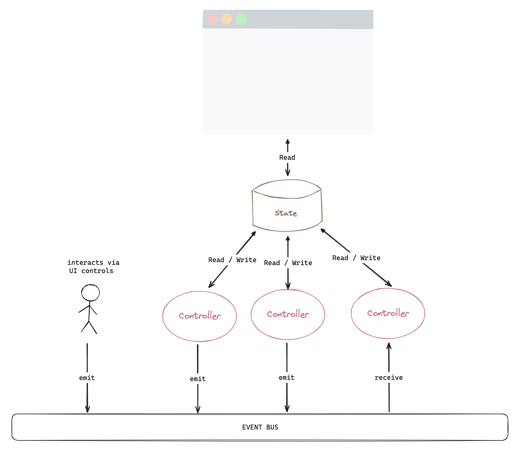
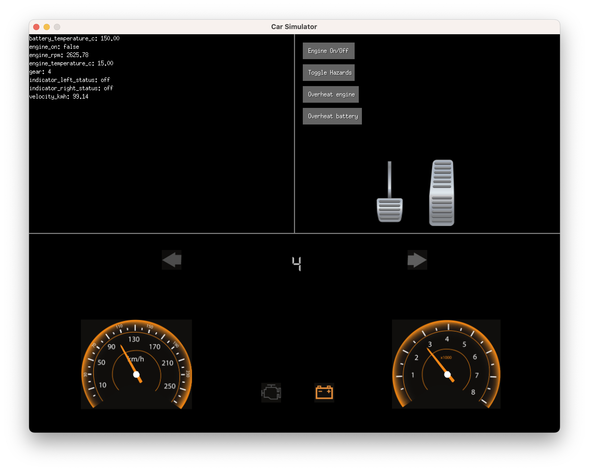

# car-simulator

[](https://github.com/SchwarzIT/go-template)

Exploring concurrency in golang by simulating the electronics behind a car dashboard.

---

This simulation uses a three-layered architecture (presentation, application and data).
Small controllers are responsible for implementing a small part of the application logic

Input to the application layer controllers is provided only through events on the shared event bus.
There are two sources of events:

- Clicking a control in the user interface
- Controllers



## Usage

The following `make` target are available:

```
make run
make help
make lint
make test
make fmt
```

## Screenshots

<p align="center">
    
</p>

## Assets used

<a href="https://www.vecteezy.com/free-vector/car-dashboard-icons">Car Dashboard Icons Vectors by Vecteezy</a><br>
<a href="https://pixabay.com/vectors/pedals-car-machine-gas-throttle-4519485/">Pedals Car Machine by RockMotorArt - Pixabay</a><br>
<a href="https://www.flaticon.com/free-icons/car" title="car icons">Car icons created by Freepik - Flaticon</a>
