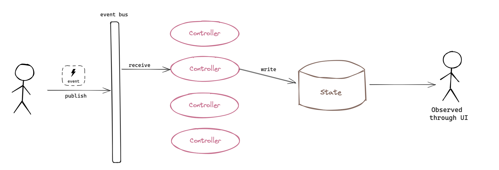
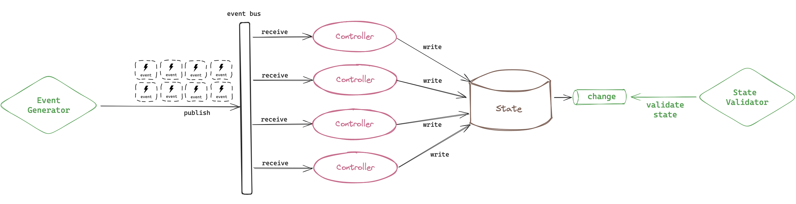

# car-simulator

[](https://github.com/SchwarzIT/go-template)

Exploring concurrency in golang by simulating the electronics behind a car dashboard.

---

This simulation uses a three-layered architecture (presentation, application and data).
Small controllers are responsible for implementing a small part of the application logic

Input to the application layer controllers is provided only through events on the shared event bus.
There are two sources of events:

- Clicking a control in the user interface
- Controllers


## Usage

The following `make` target are available:

```
make run
make help
make lint
make test
make fmt
```

## Simulation testing

In a UI-driven workflow, the following sequence of events happens:

1. The user generates an event (by interacting with the UI)
2. The event is published to the event bus
3. One or more controllers react to the event
4. The car's state is updated
5. The user observes the update in the UI

<p align="center">
    
    <em>Normal (UI) mode</em>
</p>

This is acceptable for normal usage but too cumbersome to automate for testing. Instead, this project has a simulation mode which replaces the slow element (the human) with an event generator and a state validator.

<p align="center">
    
    <em>Simulation mode</em>
</p>

In simulation mode, the following steps happen as fast as possible:

1. The Event Generator publishes an event
2. One or more controllers react to the event
3. The car's state is updated
4. The state notifies of the update through an unbuffered "change channel"
5. The State Validator validates the state against our expectations

For example, we validate that:

- The car's velocity is never negative
- The car's RPM is always between 0 and 8000
- The car's left and right indicators are always both on or off (never in a different state at the same time)

Since validation happens after every state update, the state never violates the invariants. There is one exception: sometimes a controller has to write multiple values "atomically". In between those writes the state might be in violation. We implement this simply by suspending the validation during those writes, and resuming is aferwards.

You can run `make dst` to run a simulation.

## Screenshots

<p align="center">
    
</p>

## Assets used

<a href="https://www.vecteezy.com/free-vector/car-dashboard-icons">Car Dashboard Icons Vectors by Vecteezy</a><br>
<a href="https://pixabay.com/vectors/pedals-car-machine-gas-throttle-4519485/">Pedals Car Machine by RockMotorArt - Pixabay</a><br>
<a href="https://www.flaticon.com/free-icons/car" title="car icons">Car icons created by Freepik - Flaticon</a>
